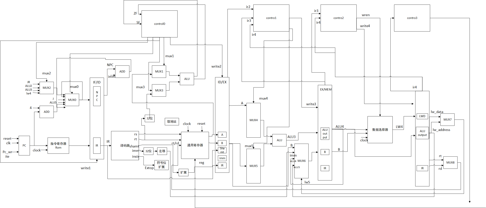
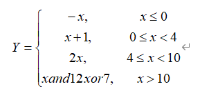

# Five-stage-pipeline-CPU-design

本设计为32位RISC处理器只是实现MIPS32TM指令集中的一个子集，所条指令分别属于3种MIPS指令类型

### 指令格式与指令列表

（1) R类型指令格式为：

R-Type指令

| op     | rs     | rt     | rd     | shamt  | func   |
| ------ | ------ | ------ | ------ | ------ | ------ |
| 6 bits | 5 bits | 5 bits | 5 bits | 5 bits | 6 bits |

两个操作数和结果都在寄存器的运算指令。如：sub rd, rs, rt

若是移位指令，则对rt的内容进行移位，结果送rd，所移位数由shamt给出。

（2）  I类型指令格式为：

I-Type指令

| op     | rs     | rt     | immediate |
| ------ | ------ | ------ | --------- |
| 6 bits | 5 bits | 5 bits | 16 bits   |

运算指令：一个寄存器、一个立即数。如：ori rt, rs, imm16

LOAD和STORE指令。如：lw rt, rs, imm16

条件分支指令。如：beq rs, rt, imm16

（3）  J类型指令格式为：

J-Type指令

| op     | Target address |
| ------ | -------------- |
| 6 bits | 26 bits        |

无条件跳转指令。如：J target

### 2.2指令集

指令集如下：

| 指令类型 | 指令名称 | 指令类型 | 指令名称 |
| -------- | -------- | -------- | -------- |
| R型      | ADD      | R型      | JR       |
| ADDU     | I型      | ADDI     |          |
| SUB      | ADDIU    |          |          |
| SUBU     | SLTI     |          |          |
| SLT      | ANDI     |          |          |
| AND      | ORI      |          |          |
| NOT      | XORI     |          |          |
| OR       | BEQ      |          |          |
| XOR      | BGEZ     |          |          |
| SLL      | BGTZ     |          |          |
| SLLV     | BLEZ     |          |          |
| SRA      | BLTZ     |          |          |
| SRAV     | LW       |          |          |
| SRL      | SW       |          |          |
| SRLV     | J型      | J        |          |

该指令集共包含30条指令，共有三种指令类型：R型、I型、J型，其中也包含了算术运算指令，逻辑运算指令，分支跳转指令，访存指令等，这些指令为后续的操作提供基础。

### 2.3 操作码及功能码的编码

| 类别         | 指令名称                                        | 汇编举例                                                     | 含义                                                         | 机器代码                              | 指令类型 |
| ------------ | ----------------------------------------------- | ------------------------------------------------------------ | ------------------------------------------------------------ | ------------------------------------- | -------- |
| 算数运算指令 | ADD                                             | ADD rd,rs,rt（可产生溢出）                                   | G[rd]=G[rs]+G[rt]                                            | 000000.xxxxx.yyyyy,zzzzz.00000.000000 | R        |
| ADDI         | ADDI rd,rs,imm16（可产生溢出）                  | G[rd]=G[rs]+SignExt  (imm16)                                 | 000100.xxxxx.yyyyy.zzzzzzzzzzzzzzzz                          | I                                     |          |
| ADDU         | ADDU rd,rs,rt（不可产生溢出）                   | G[rd]=G[rs]+G[rt]                                            | 000000.xxxxx.yyyyy.zzzzz.00000.000100                        | R                                     |          |
| ADDIU        | ADDIU rd,rs,imm16（不可产生溢出）               | G[rd]=G[rs]+SignExt  (imm16)                                 | 000101.xxxxx.yyyyy.zzzzzzzzzzzzzzzz                          | I                                     |          |
| SUB          | SUB rd,rs,rt（可产生溢出）                      | G[rd]=G[rs]-G[rt]                                            | 00000.xxxxx.yyyyy.zzzzz.00000.001000                         | R                                     |          |
| SUBU         | SUBU rd,rs,rt（不可产生溢出）                   | G[rd]=G[rs]-G[rt]                                            | 000000.xxxxx.yyyyy.zzzzz.00000.001100                        | R                                     |          |
| SLT          | SLT rd,rs,rt(有符号比较）                       | G[rd]=1 (G[rs]<G[rd])  G[rd]=0 (G[rs]>G[rd])                 | 000000.xxxxx.yyyyy.zzzzz.00000.010000                        | R                                     |          |
| SLTI         | SLTI rd,rs,imm16（有符号比较）                  | G[rd]=1  (G[rs]<SignExt(imm16))  G[rd]=0  (G[rs]>SignExt(imm16)) | 000110.xxxxx.yyyyy.zzzzzzzzzzzzzzzz                          | I                                     |          |
| 逻辑运算指令 | AND                                             | AND rd, rs, rt （位与）                                      | G[rd] =G[rs] & G[rt]                                         | 000001.xxxxx.yyyyy.zzzzz.00000.000000 | R        |
| ANDI         | ANDI rt, rs, imm16 （立即数位与）               | GPR[rt]=G[rs] and ZeroExt(imm16)                             | 000111xxxxx.yyyyy.zzzzzzzzzzzzzzzz                           | I                                     |          |
| NOT          | NOT rd,rs （位或非）                            | G[rd] = NOT G[rs]                                            | 000001.xxxxx.00000.zzzzz.00000.000100                        | R                                     |          |
| OR           | OR rd, rs, rt （位或）                          | GPR[rd] = G[rs] or G[rt]                                     | 000001.xxxxx.yyyyy.zzzzz.00000.001000                        | R                                     |          |
| ORI          | ORI rt, rs, imm16 (立即数位或）                 | G[rt] = G[rs] or ZeroExt(imm16)                              | 001000.xxxxx.yyyyy.zzzzzzzzzzzzzzzz                          | I                                     |          |
| XOR          | XOR rd, rs, rt（位异或）                        | G[rd] = G[rs] xor G[rt]                                      | 000001.xxxxx.yyyyy.zzzzz.00000.001100                        | R                                     |          |
| XORI         | XORI rt, rs,imm16（立即数位异或）               | G=[rt] = G=[rs] xor ZeroExt(imm16)                           | 001001.xxxxx.yyyyy.zzzzzzzzzzzzzzzz                          | I                                     |          |
| 移位指令     | SLL                                             | SLL rd, rt, sa (立即数逻辑左移)                              | s =sa  G [rd]=G [rs] \|\| | 000010.xxxxx.yyyyy.zzzzz.00000.000000 | R        |
| SLLV         | SLLV rd, rs, rt （变量逻辑左移 ）               | s = G [rs]  G [rd] =G [rs] (31-s)..0  \|\| | 000010.xxxxx.yyyyy.zzzzz.00000.000100                        | R                                     |          |
| SRA          | SRA rd, rt, sa（立即数算术右移）                | s = sa  G [rd] = \|\| G  [rs] 31..s | 000010.xxxxx.yyyyy.zzzzz.00000.001000                        | R                                     |          |
| SRAV         | SRAV rd, rs, rt （变量算术右移）                | s = G [rs]  G [rd]= \|\| G  [rs] 31..s | 000010.xxxxx.yyyyy.zzzzz.00000.001100                        | R                                     |          |
| SRL          | SRL rd, rt, sa （立即数逻辑右移）               | s = sa             GPR[rd] ←  \|\|    GPR[rs] 31..s | 000010.xxxxx.yyyyy.zzzzz.00000.010000                        | R                                     |          |
| SRLV         | SRLV rd, rs, rt （变量逻辑右移）                | s = G [rs]  G [rd]= \|\| G [rs] 31..s | 000010.xxxxx.yyyyy.zzzzz.00000.010100                        | R                                     |          |
| 分支跳转指令 | BEQ                                             | BEQ rs, rt, offset（相等转移）                               | PC=PC+SignExt(offset)  (G[rs]=G[rt]);  PC=PC+4(G[rs]!=G[rt]) | 001010.xxxxx.yyyyy.zzzzzzzzzzzzzzzz   | I        |
| BGEZ         | BGEZ rs, offset （大于等于0 转移）              | PC=PC+SignExt(offset)  (G[rs]>= 0);  PC=PC+4(G[rs]<0)        | 001011.xxxxx.yyyyy.zzzzzzzzzzzzzzzz                          | I                                     |          |
| BGTZ         | BGEZ rs, offset （大于0 转移）                  | PC=PC+SignExt(offset)  (G[rs]> 0);  PC=PC+4(G[rs]<0)         | 001100.xxxxx.yyyyy.zzzzzzzzzzzzzzzz                          | I                                     |          |
| BLEZ         | BGEZ rs, offset （小于等于0 转移）              | PC=PC+SignExt(offset)  (G[rs]<= 0);  PC=PC+4(G[rs]<0)        | 001101.xxxxx.yyyyy.zzzzzzzzzzzzzzzz                          | I                                     |          |
| BLTZ         | BLTZ rs, offset （小于 0 转移）                 | PC=PC+SignExt(offset)  (G[rs]>0);  PC=PC+4 (G[rs]<=0)        | 001110.xxxxx.yyyyy.zzzzzzzzzzzzzzzz                          | I                                     |          |
| J            | J target（无条件直接跳转）                      |  | 010001.xxxxxxxxxxxxxxxxxxxxxxxxxx                            | J                                     |          |
| JR           | JR rs  (无条件跳转。跳转目标为寄存器 rs 中的值) | PC = GPR[rs]                                                 | 000011.xxxxx.yyyyy.zzzzz.00000.000000                        | R                                     |          |
| 访存指令     | LW                                              | LW rt, offset(base) (取字)                                   | PC=SignExt(offset)                                           | 001111.xxxxx.yyyyy.zzzzzzzzzzzzzzzz   | I        |
| SW           | SW rt, offset(base) (存字                       | PC=SignExt(offset)                                           | 010000.xxxxx.yyyyy.zzzzzzzzzzzzzzzz                          | I                                     |          |

### 2.4 指令流程

| 指令名称 | IF                                                           | ID                                                           | EX                                                           | MEM                    | WB              |
| -------- | ------------------------------------------------------------ | ------------------------------------------------------------ | ------------------------------------------------------------ | ---------------------- | --------------- |
| ADD      | IR← M[pc]  PC← PC+4                                          | busA ← R [rs] ; busB ← R [rt] ;  Target ← PC + SignExt(imm16)*4 | temp←G[rs]+G[rt]                                             | G[rd] ←temp            |                 |
| ADDU     | temp←G[rs]+G[rt]                                             | G[rd] ←temp                                                  |                                                              |                        |                 |
| SUB      | temp←G[rs]-G[rt]                                             | G[rd] ←temp                                                  |                                                              |                        |                 |
| SUBU     | temp←G[rs]-G[rt]                                             | G[rd] ←temp                                                  |                                                              |                        |                 |
| SLT      | if SF=1 temp←1  else temp← 0                                 | G[rd] ←temp                                                  |                                                              |                        |                 |
| ADDI     | IR← M[pc]  PC← PC+4                                          | busA ← R [rs] ; busB ← R [rt] ;  Target ← PC + SignExt(imm16)*4 | temp←G[rs]+  SignExt (imm16)                                 | G[rt] ←temp            |                 |
| ADDIU    | temp←G [rs] +  sign_Ext(imm16)                               | G[rt] ←temp                                                  |                                                              |                        |                 |
| SLTI     | if SF=1 temp←1  else temp← 0                                 | G[rt] ←temp                                                  |                                                              |                        |                 |
| AND      | IR← M[pc]  PC← PC+4                                          | busA ← R [rs] ; busB ← R [rt] ;  Target ← PC + SignExt(imm16)*4 | temp←G[rs]  &G[rt]                                           | G[rd] ←temp            |                 |
| NOT      | temp←NOT G [rs]                                              | G[rd] ←temp                                                  |                                                              |                        |                 |
| OR       | temp←G [rs] or G  [rt]                                       | G[rd] ←temp                                                  |                                                              |                        |                 |
| XOR      | temp←G [rs] xor  G [rt]                                      | G[rd] ←temp                                                  |                                                              |                        |                 |
| ANDI     | IR← M[pc]  PC← PC+4                                          | busA ← R [rs] ; busB ← R [rt] ;  Target ← PC + SignExt(imm16)*4 | temp←G [rs]  & sign_Ext(imm16)                               | G[rt] ←temp            |                 |
| ORI      | temp←G [rs] or  Zero_Ext(imm16)                              | G[rt] ←temp                                                  |                                                              |                        |                 |
| XORI     | temp←G [rs] xor  Zero_Ext(imm16)                             | G[rt] ←temp                                                  |                                                              |                        |                 |
| SLL      | IR← M[pc]  PC← PC+4                                          | busA ← R [rs] ; busB ← R [rt] ;  Target ← PC + SignExt(imm16)*4 | GPR[rd] ← GPR[rs] (31-sa)..0 \|\| | G[rd] ←temp            |                 |
| SLLV     | temp← GPR[rs]  (31- GPR[rs] 4..0)..0 \|\| | G[rd] ←temp                                                  |                                                              |                        |                 |
| SRA      | temp← (GPR[rs]  31 ) GPR[rs] 4..0 \|\| GPR[rs] 31..  GPR[rs] 4..0 | G[rd] ←temp                                                  |                                                              |                        |                 |
| SRAV     | temp←GPR[rs]  (31-sa)..0 \|\|0 sa                            | G[rd] ←temp                                                  |                                                              |                        |                 |
| SRL      | temp←0 sa \|\| GPR[rs] 31..sa                                | G[rd] ←temp                                                  |                                                              |                        |                 |
| SRLV     | temp← 0 GPR[rs]  4..0 \|\| GPR[rs] 31.. GPR[rs] 4..0         | G[rd] ←temp                                                  |                                                              |                        |                 |
| BEQ      | IR← M[pc]  PC← PC+4                                          | busA ← R [rs] ; busB ← R [rt] ;  Target ← PC + SignExt(imm16)*4  If ZF=1  PC ← PC+Target | _                                                            |                        |                 |
| BGEZ     | busA ← R [rs] ; busB ← R [rt] ;  Target ← PC + SignExt(imm16)*4  If ZF=1\|\|SF=0  PC ← PC+Target | _                                                            |                                                              |                        |                 |
| BGTZ     | busA ← R [rs] ; busB ← R [rt] ;  Target ← PC + SignExt(imm16)*4  If SF=0  PC ←PC+Target_ |                                                              |                                                              |                        |                 |
| BLEZ     | busA ← R [rs] ; busB ← R [rt] ;  Target ← PC + SignExt(imm16)*4  If ZF=1\|\| SF=1  PC ←PC+Target_ |                                                              |                                                              |                        |                 |
| BLTZ     | busA ← R [rs] ; busB ← R [rt] ;  Target ← PC + SignExt(imm16)*4  If SF=1  PC ←PC+Target_ |                                                              |                                                              |                        |                 |
| J        | IR← M[pc]  PC← PC+4                                          | busA ← R [rs] ; busB ← R [rt] ;  Target ← PC + SignExt(imm16)*4 PC←PC[31..28]\|\| target\|\|00 |                                                              |                        |                 |
| JR       | IR← M[pc]  PC← PC+4                                          | busA ← R [rs] ; busB ← R [rt] ;  Target ← PC + SignExt(imm16)*4 temp←G [rs]   PC←temp |                                                              |                        |                 |
| LW       | IR← M[pc]  PC← PC+4                                          | busA ← R [rs] ; busB ← R [rt] ;  Target ← PC + SignExt(imm16)*4 | ALUoutput←busA+  SignExt[imm16]                              | MemDout←  M[ALUoutput] | R[rt]←  MemDout |
| SW       | ALUoutput←busA+  SignExt[imm16]                              | M[ALUoutput]←busB                                            |                                                              |                        |                 |

### 数据通路

### 指令测试

本实验根据上述选择的30条指令，设计了分支跳转语句如下：

该分支语句使用到了算术运算、逻辑运算、移位、跳转、比较等指令，根据上面设计的数据通路，进行器件的编写以及功能的实现

# Five-stage-pipeline-CPU-design
